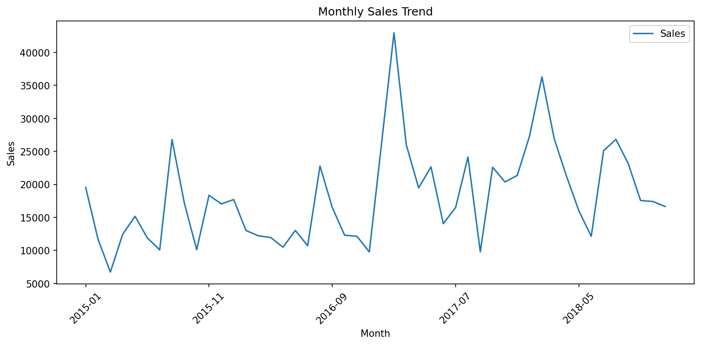

# Sales Data Analysis Project

## Project Objective
Analyze sales data to identify total revenue, category performance, and monthly trends.

## Dataset
Source: Kaggle Sales Forecasting dataset (Superstore)

## Tools Used
- Python (pandas, matplotlib)
- SQL (SQLite)

## Key Findings
1. **Total Sales**: $2.26 million
2. **Top Performing Category**: Technology ($827K), followed by Furniture ($729K) and Office Supplies ($705K)
3. **Monthly Trend**: Sales fluctuate between $10K-$27K per month, with no strong seasonality (see chart below)

## Visualizations

## How to Reproduce
1. Clone this repository
2. Install required libraries: `pip install pandas matplotlib jupyter`
3. Open the Jupyter Notebook and run all cells

## Author
Jingyi

## Date
2026/4/13
